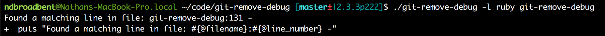

## git-remove-debug


-----------------------------------

## Summary

You've just fixed a bug in your code. The only problem is that you used a bunch of print statements and debugger calls, so now you have to clean those up. You can use `git checkout -p` to manually work through all the changes, but you have to be careful, and sometimes you can't "split the hunk" to remove a single line.

`git-remove-debug` cleans up your debugging statements with a single command.


## Full Description and Usage

This is a small script that parses the output from `git diff`. By default, it deletes any **new** or **changed** lines that are "debugging statements". You can also pass a custom regex to match lines.

You can pass the `-a` flag (or `--all`) to remove debugging statements from all files that are checked in to the git repository.

The script will show you every line that it is about to delete, and will ask you to confirm the changes. You can skip the confirmation by using the `-f` (or `--force`) option.

The script also has a patch mode (`-p` or `--patch`), similar to `git add -p` or `git checkout -p`. When running in patch mode, the script will prompt you to confirm every individual line. You can press `q` or `Ctrl+C` to cancel at any time. You can also press `d` to skip the rest of the lines, and only delete what you have already confirmed.

> NOTE: Unlike `git add -p`, you don't have to press return after pressing 'y' or 'n'.

> WARNING: In patch mode, the script will NOT ask for a final confirmation.


## Examples

```bash
$ git-remove-debug --help

Usage: git-remove-debug [options] [files]
    -r, --regex=REGEX                Use a custom regex for changed lines
    -l, --lang=LANGUAGE              Use the regex for a given language
    -p, --patch                      Asks you to confirm the deletion of each matching line
    -a, --all                        Scans all files that are checked in to the git repository
    -f, --force                      Does not prompt before deleting lines
    -h, --help                       Show this message

# Deletes any debugging statements from new or changed files.
# Will display all of the proposed changes, and ask you to confirm before deleting.
$ git-remove-debug

# Scans all files that are checked in to the git repository.
# You can pass a subdirectory, and it will recursively scan files in that directory.
# NOTE: If you call this on a large repo, you're not going to have a good time.
$ git-remove-debug -a  # (or --all)

# Delete all debugging statements without confirming first.
$ git-remove-debug -f  # (or --force)

# Only looks for new debugging statements in the given files
$ git-remove-debug <file> <other_file>

# Enable patch mode. This will ask you to confirm every individual line.
# You can choose one of the following options:
#
# y - Yes, delete this line
# n - No, don’t delete this line
# d - No, don’t delete this line, and skip all remaining lines.
# q - Quit and don't delete anything.
#
$ git-remove-debug -p  # (or --patch)

# Deletes any new or changed lines, where the line matches the given regex
$ git-remove-debug -r "^\s*testing"  # (or --regex)

# Use the built-in regex for a given language.
# (For when you want to process files that don't have an extension)
$ git-remove-debug -l ruby  # (or --lang)
```

## Disclaimer and Backups

This software is provided without warranty of any kind. By using this script, you agree and understand that I can not be held personally responsible for any data loss.

To protect against loss of data, the script will make a backup copy of any file that it touches. The backup path will be displayed in the console.

Please note that this script may not work for all encodings and line endings. You should also be very careful if your filenames contain any spaces or UTF8 characters.


## Recognized Debugging Statements

By default, this script will remove any **new** or **changed** lines that contain any of the following debugger calls and print statements. (Use the `-a` or `--all` flag to scan all files in the git repo.)

99% of my print statements are just a single line. If you have a multi-line print statement, you'll have to delete that manually for now. (Pull requests are welcome!)


### JavaScript

* Extension: `/\.jsx?$/`
* Removes:
  * `console.log`
  * `console.debug`
  * `console.warn`
  * `console.error`
  * `debugger`

### Ruby

* Extension: `/\.rb$/`
* Removes:
  * `puts`
  * `print`
  * `debugger`
  * `require 'byebug'`    *(Ruby >= 2.0)*
  * `require 'debugger'`  *(Ruby <= 1.9)*

### Python

* Extension: `/\.py$/`
* Removes:
  * `print`
  * `import pdb`
  * `pdb.set_trace`

### Others

Pull requests are welcome!


## Default languages

The script has built-in support for some common files that don't have an extension:

* Ruby:
  * `Gemfile`
  * `Rakefile`
  * `Guardfile`
* JavaScript
  * `Gruntfile`

Feel free to add some more and send a PR.


## Requirements

Either Mac or Linux, and a version of Ruby >= 2.0.0.

This script does not use any Ruby gems.


## Installation

You could clone the repo somewhere and set up an alias:

```bash
cd ~
git clone https://github.com/ndbroadbent/git-remove-debug.git
alias grd="~/git-remove-debug/git-remove-debug"

# Make the alias permanent by adding it to your ~/.bashrc
echo "alias grd=\"~/git-remove-debug/git-remove-debug\"" >> ~/.bashrc
```


---------------------------------------------------


